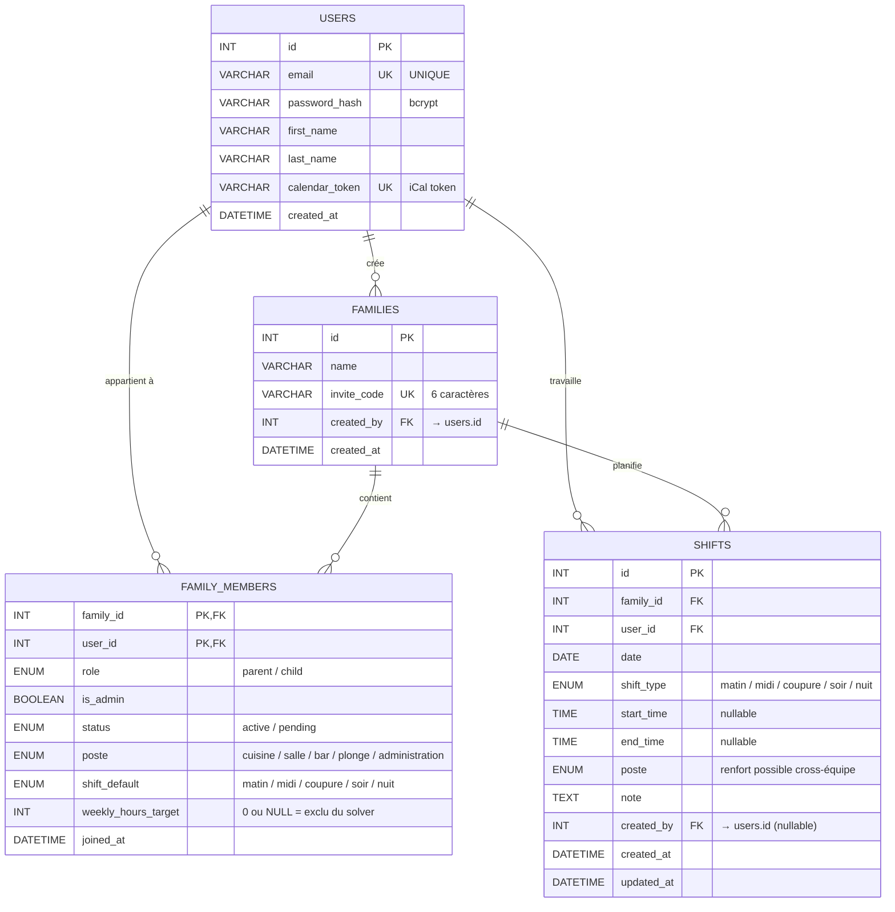

# Schéma de base de données — Crew

> MCD / MLD de la base **MariaDB 10.11** utilisée par Crew.
> Source de vérité : `back/migrations/*.sql`.

## Diagramme entité-association (Mermaid)

## Description textuelle

### `users`
Compte applicatif. Une seule identité par adresse email. Le `calendar_token` est un secret long généré aléatoirement à l'inscription : il sert d'URL personnelle pour le flux iCal sans nécessiter d'authentification supplémentaire.

### `families`
Une « famille » au sens technique = une équipe au sens métier. Chaque équipe possède un `invite_code` à 6 caractères que le manager partage avec ses équipiers. Le `created_by` désigne le créateur (par défaut admin).

### `family_members`
Table d'association **N-N** entre `users` et `families`, enrichie des champs métier utilisés par le solver d'auto-planning :

- `role` (parent/child) — rôle générique, hérité du modèle initial.
- `is_admin` — un membre peut être promu administrateur.
- `status` — `pending` jusqu'à approbation par l'admin, puis `active`.
- `poste` — zone fonctionnelle habituelle.
- `shift_default` — créneau préféré (sert de score au solver).
- `weekly_hours_target` — heures contractuelles cibles. `0` ou `NULL` exclut l'équipier du solver (utile pour les cadres ou les extras).

### `shifts`
Cœur du planning. Chaque ligne = un créneau planifié pour un équipier donné, un jour donné, un type de shift donné.

- **Unicité** `(user_id, date, shift_type)` empêche le double-planning sur un même créneau.
- `poste` peut différer du `poste` habituel de l'équipier (renfort cross-équipe).
- `start_time` / `end_time` sont optionnels : si non renseignés, les horaires sont dérivés du `shift_type` côté front.

## Règles d'intégrité

| Règle                                      | Mécanisme                                         |
| ------------------------------------------ | ------------------------------------------------- |
| Email unique                               | `UNIQUE` sur `users.email`                        |
| Token iCal unique                          | `UNIQUE` sur `users.calendar_token`               |
| Code d'invitation unique                   | `UNIQUE` sur `families.invite_code`               |
| Pas de double-planning                     | `UNIQUE (user_id, date, shift_type)` sur `shifts` |
| Suppression d'équipe ⇒ cascade des shifts  | `FK family_id ON DELETE CASCADE`                  |
| Suppression d'utilisateur ⇒ cascade        | `FK user_id ON DELETE CASCADE`                    |
| Créateur de l'équipe protégé               | `FK created_by ON DELETE RESTRICT`                |
| Historisation du créateur d'un shift       | `FK created_by ON DELETE SET NULL`                |

## Index principaux

- `users(email)` — recherche par email à la connexion.
- `users(calendar_token)` — résolution rapide du token iCal.
- `families(invite_code)` — vérification du code à l'adhésion.
- `family_members(user_id)` — liste des équipes d'un utilisateur.
- `family_members(family_id, poste)` — solver : équipiers disponibles par poste.
- `shifts(user_id, date)` — agenda personnel.
- `shifts(family_id, date)` — grille hebdomadaire d'équipe.

## Versionnage du schéma

Les migrations sont appliquées séquentiellement par `npm run migrate` :

1. `001_users.sql` — comptes
2. `002_families.sql` — équipes
3. `003_family_members.sql` — association + rôles
4. `004_member_planning_fields.sql` — champs métier solver
5. `005_shifts.sql` — créneaux planifiés

Toute évolution future doit ajouter un fichier `00X_…sql` numéroté.
